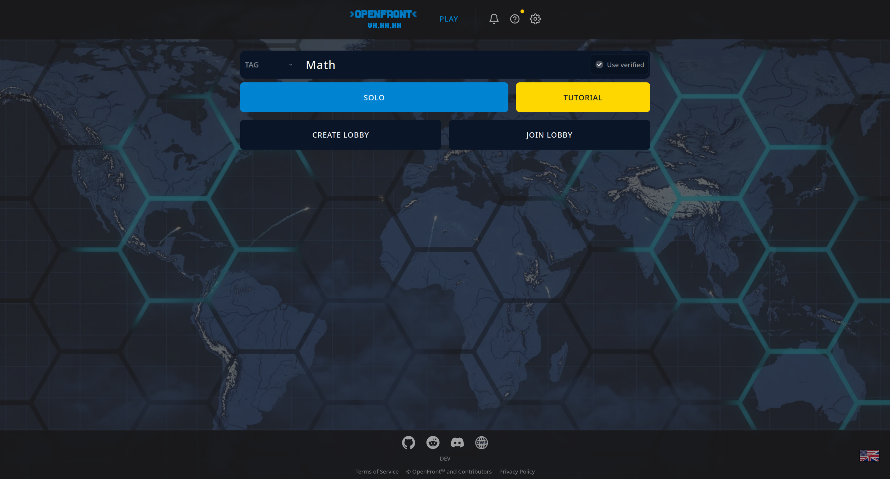

<p align="center">
  <picture>
    <source media="(prefers-color-scheme: dark)" srcset="proprietary/images/OpenFrontLogoDark.svg">
    <source media="(prefers-color-scheme: light)" srcset="proprietary/images/OpenFrontLogo.svg">
    
  </picture>
</p>

# openfront-light

[](https://github.com/TekMath/openfront-light/actions/workflows/ci.yml)

**openfront-light** is a stripped-down fork of [OpenFront](https://github.com/openfrontio/OpenFrontIO)
for self-hosting a **private server**, so you can play with a few friends.
It is not meant to be a public server.

OpenFront.io depends on a closed-source API for accounts, the store, clans,
leaderboards, public matchmaking, the server registry and more. This fork runs
without it:

- **Solo and private games only.** There are no public lobbies, no ranked
  mode and no matchmaking. You create a private lobby and share its link.
- **No ads, promos or tracking.** Ad networks, analytics, Twitch and Steam
  promos, and the news feed are removed.
- **No account features in the menu.** Store, inventory, clans, leaderboard
  and login are no longer linked.
- **No calls to the closed-source API.** The server and the client skip them
  instead of failing and filling the logs.
- **A small Docker image.** It runs one process on one port, with no nginx,
  and embeds only the maps you choose.

<p align="center">
  
</p>

Every divergence from upstream is listed in the changelog in
[`CLAUDE.md`](CLAUDE.md) and marked in the code with an `openfront-light:`
comment (`grep -rn "openfront-light:"`).

## How it runs

The game simulation runs in each player's browser. The server only hosts the
page and relays player actions between browsers. A small instance can
therefore handle a few games at once.

The image (`Dockerfile.light`) contains:

- one `node` process tree, a master plus 1 worker, listening on **one HTTP
  port (8080)**. The master forwards game and WebSocket traffic to the worker
  itself, so no reverse proxy is needed inside the container;
- the server bundled into a single file, with no `node_modules` and no
  sources;
- the built client with **only the selected maps**. All maps together take
  about 600 MB, which is most of the size.

The image does not handle HTTPS. Run it behind something that terminates TLS
and passes WebSockets through, such as a PaaS (Clever Cloud, ...), a
Cloudflare tunnel, or your own Caddy, Traefik or nginx. On a LAN or a VPN,
plain HTTP works.

## Quick start: the prebuilt image

An image is published with a curated map selection:

```
ghcr.io/tekmath/openfront-light:latest
```

Maps included: **World, Giant World Map, Europe, North America, South
America, Asia, Africa**.

Images are published when a version tag is pushed, after lint, tests and the
other checks pass (see [Releasing](#releasing)). `latest` is the newest stable
release; pin a version (e.g. `:v1.0.0`) to stay on it.

```bash
docker run -d --name openfront -p 8080:8080 \
  -e DOMAIN=games.example.com \
  ghcr.io/tekmath/openfront-light:latest
```

Open `http://localhost:8080` (or your domain behind your TLS proxy). Then
click **Create Lobby** and send the lobby link to your friends.

## Build your own image

Build your own image to choose other maps or to include your own changes.

```bash
git clone https://github.com/TekMath/openfront-light.git
cd openfront-light
docker build -f Dockerfile.light \
  --build-arg OPENFRONT_MAPS=world,europe,iceland \
  --build-arg GIT_COMMIT=$(git rev-parse --short HEAD) \
  -t openfront-light .
```

### Build arguments

| Argument         | Default   | Description                                                                                                                                                                                |
| ---------------- | --------- | ------------------------------------------------------------------------------------------------------------------------------------------------------------------------------------------ |
| `OPENFRONT_MAPS` | empty     | Comma-separated map folder names from [`resources/maps/`](resources/maps) (e.g. `world,giantworldmap,europe`). **Empty embeds every map** (about 600 MB). An unknown name fails the build. |
| `GIT_COMMIT`     | `unknown` | Version string shown by the client and in `/commit.txt`.                                                                                                                                   |

To list the available map names, run `ls resources/maps`. The map picker, the
random-map button and the default map only offer the embedded maps. If you
leave out `world`, the first embedded map becomes the default.

The prebuilt image uses the following value (the `OPENFRONT_MAPS` repository
variable overrides it in CI):

```
OPENFRONT_MAPS=world,giantworldmap,europe,northamerica,southamerica,asia,africa
```

## Environment variables

All variables have defaults that work for a single private server. Usually you
only set `DOMAIN`.

| Variable             | Default                    | Description                                                                                                                                           |
| -------------------- | -------------------------- | ----------------------------------------------------------------------------------------------------------------------------------------------------- |
| `DOMAIN`             | (none)                     | Host name players use to reach the server (e.g. `games.example.com`).                                                                                 |
| `PORT`               | `8080`                     | The single HTTP port the server listens on.                                                                                                           |
| `NUM_WORKERS`        | `1`                        | Number of game worker processes. One is enough for a few games at once. Only change it while no game is running: game IDs are routed by worker count. |
| `NODE_OPTIONS`       | `--max-old-space-size=384` | Node heap cap per process. Raise it if you host many large games.                                                                                     |
| `TURNSTILE_SITE_KEY` | Cloudflare test key        | The default always passes. Nothing checks for bots on a private server.                                                                               |
| `ADMIN_BOT_API_KEY`  | (unset)                    | Set it to enable the admin bot HTTP API (`src/server/AdminBotRoutes.ts`). Unset keeps that API off.                                                   |
| `INSTANCE_LETTER`    | `a`                        | Prefix of every game ID. Leave it as is.                                                                                                              |
| `GAME_ENV`           | `prod`                     | Leave it as is. `dev` enables development defaults.                                                                                                   |
| `WORKER_PROXY`       | `inprocess`                | Makes the master forward worker traffic itself. Leave it as is.                                                                                       |

Leave `SUBDOMAIN`, `LOBBY_COORDINATOR`, `CDN_BASE` and the `OTEL_*` variables
**unset**. They only apply to the openfront.io infrastructure.

### Example: docker compose

```yaml
services:
  openfront:
    image: ghcr.io/tekmath/openfront-light:latest
    restart: unless-stopped
    ports:
      - "8080:8080"
    environment:
      DOMAIN: games.example.com
```

### Example: Clever Cloud

Create a **Docker** application from this repository. Then set
`CC_DOCKERFILE=Dockerfile.light` and `DOMAIN`. To choose the maps, change the
`ARG OPENFRONT_MAPS=""` default in `Dockerfile.light`. The app listens on
8080, as Clever expects. Their load balancer handles HTTPS and WebSockets.

More details are in [`docs/SelfHost.md`](docs/SelfHost.md).

## Releasing

The [CI workflow](.github/workflows/ci.yml) checks every PR and push, and
builds the image without publishing it. To publish, push a tag starting with
`v`:

```bash
git tag v1.0.0
git push origin v1.0.0
```

This pushes `ghcr.io/tekmath/openfront-light:v1.0.0` and moves `:latest`. A
pre-release tag such as `v1.1.0-rc.1` only publishes its own tag and leaves
`:latest` alone. The embedded maps come from the `OPENFRONT_MAPS` repository
variable (Settings > Secrets and variables > Actions > Variables), or the
default list above.

## Local development

```bash
npm run inst # npm ci --ignore-scripts (never `npm install`)
npm run dev  # client on http://localhost:9000, server on :3000
npm test
```

You need Node.js `>=24.15 <25` and npm `>=12.1 <13`. See [`CLAUDE.md`](CLAUDE.md)
for the architecture and the conventions.

## License

This is a fork of [OpenFront](https://github.com/openfrontio/OpenFrontIO),
itself a fork and rewrite of [WarFront.io](https://github.com/WarFrontIO).

- Source code: **GNU Affero General Public License v3.0** ([LICENSE](LICENSE)).
  If you run a modified version on a server, the AGPL requires you to offer
  its source to your players. Keep the "© OpenFront and Contributors" notices
  (footer and loading screen) visible.
- Assets in `resources/`: **CC BY-SA 4.0** ([LICENSE-ASSETS](LICENSE-ASSETS)).
- Assets in `proprietary/` (logos, font, sounds): **All Rights Reserved**. See
  [LICENSING.md](LICENSING.md).
